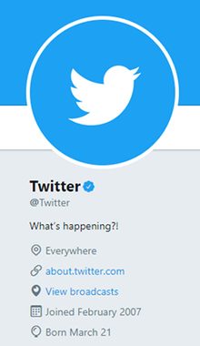
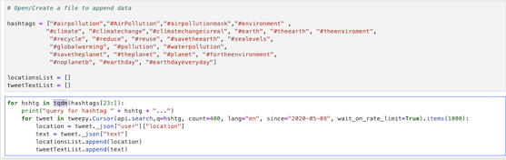
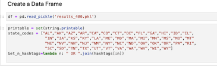
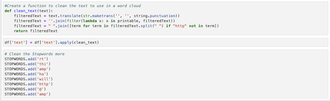
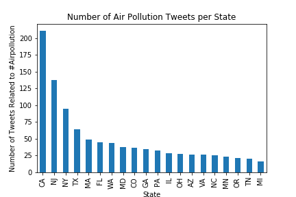
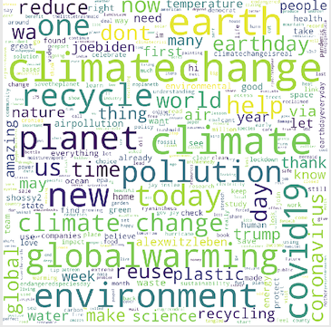
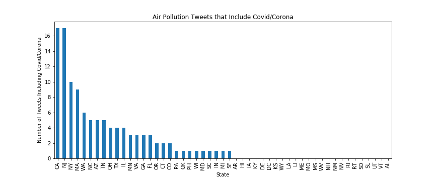
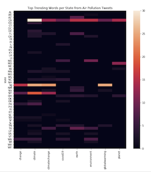

# Social-Media-Analysis-On-Air-Pollution
Analyzed Twitter API for Air Pollution Data. Python Scripting with Twitter API

## Does Air Pollution Really Matter to the US Population?
* The data was collected through Twitter API on their Twitter Developer site. 
* Was only able to collect the data for 7 days due to my subsription being standard. (Dates: 05.08.2020-05.15.2020)
* Due to the information being global and not being able to use the geotag coordintes, 
  there was quite a bit of cleaning up to do with the locations parameter. Since I wanted
  to find information for each state. 

## Why Twitter?
* Twitter Is An American Microblogging and Social Networking Service.
* Which Users Post and Interact with messages known as “Tweets.”
* Micro-blogs allow users to exchange small elements of content such as short sentences, individual images, or video Links

## Cleaning the Data
* Due to my standard account, there was a limit of how many tweets that one could pull, so I pulled a 100 tweets per hashtag. 
* Was able to find 25 trending hashtags that were relatable on air pollution from Allhashtag.com. 
* Data had to be pulled twice due to being timed out from twitter. tqdm was used in order to speed up this process.
* A location list and text list were created inorder to store the data.
* Could not pull tweets based on geo coordinates since my account was standard, location parameter was used instead.
* The tweets pulled were global, but the information is for the US only. 
* Creating state codes in the location parameter. 
* Used Stopwords in order to clean the text and added some words that I wanted to remove in order to clean the data.

## Number of Pollution Tweets Per State

* CA, NJ, NY, TX tweet the most about air pollution.
* CA has some of the most polluted citites so it would make sense that it has the most tweets.

## World Cloud Based on the Twitter Text

* Due to the quarentine there were a number of texts about Covid-19 and Coronavirus besides the information on the up    coming election in Nov. 2020.

## Bar Graph based on Air Pollution, Covid-19, and Coronavirus Hashtags.  

* CA, NJ, NY, MA tweet the most about air pollution, covid-19, coronavirus.
* From this we see the contributing states that are concered about this information.  Some tweets show people posting images       where the air pollution went down.
* Others were concerned about air pollution being a contributing factor in contracting the virus and deaths.
* There were links to articles based on Harvard research so that is why MA is in the top 4 instead of TX. 

## Heat Map based on Top 8 Trending Words 

* Top 8 words: change, climate, climatechange, covid-19, earth, environment,  globalwarming, planet
* CA has a number of tweets for all top 8 except for change.
* NJ has a high number of tweets for globalwarming, climatechange, climate, and change.
* NY has some tweets for climate and climate change.

## Conclusion
* There is awareness of air pollution in the US.  
* CA has the most tweets about this subject due to having some cities with the most pollution. 
* Was hoping to see more states tweet about this subject.
* Was able to pull current event information on Conronavirus and Covid-19. 

